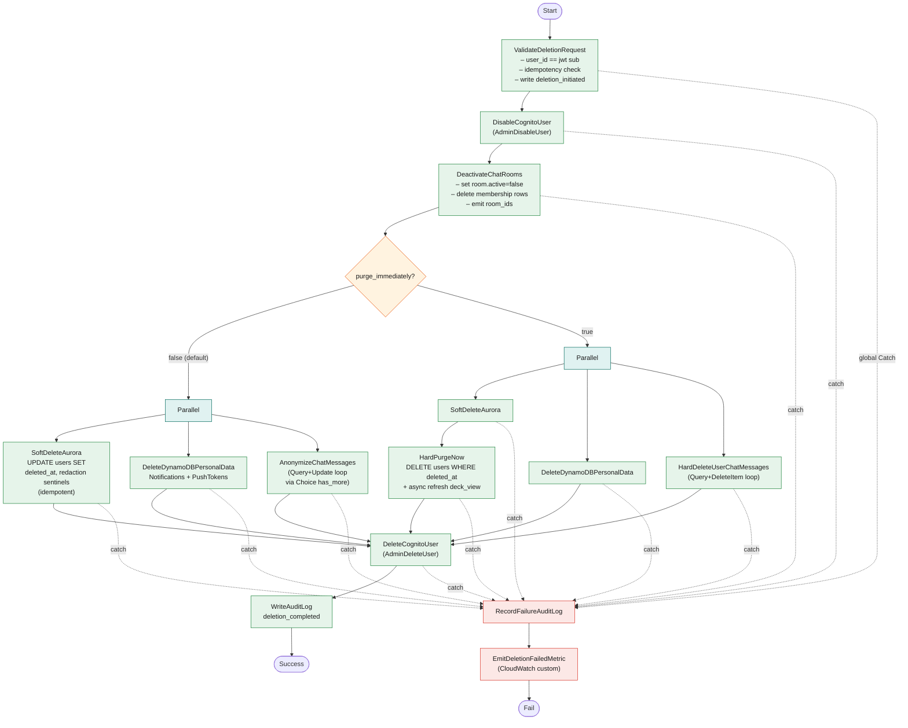
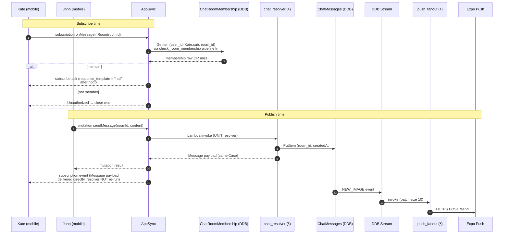

# Knotify Backend — Architecture (Phases 1–9)

Snapshot of the AWS infrastructure deployed to `dev`. Source of truth: `infrastructure/modules/`.

- **Region:** `eu-central-1`
- **Account:** `776217504626` (dev)
- **State:** phases 1–9 done, phase 10 (observability) next
- **Stack:** Terraform 1.11.4, Python 3.14 (Lambda, arm64), Aurora PostgreSQL 16.4, DynamoDB on-demand, AppSync GraphQL, API Gateway HTTP API, Step Functions Standard

---

## High-level architecture

```mermaid
flowchart TB
    classDef client fill:#e8f0fe,stroke:#1a73e8,color:#1a1a1a
    classDef edge fill:#fef7e0,stroke:#f9ab00,color:#1a1a1a
    classDef api fill:#fce8e6,stroke:#d93025,color:#1a1a1a
    classDef compute fill:#e6f4ea,stroke:#188038,color:#1a1a1a
    classDef data fill:#f3e8fd,stroke:#8430ce,color:#1a1a1a
    classDef stream fill:#fff3e0,stroke:#e65100,color:#1a1a1a
    classDef orch fill:#e0f2f1,stroke:#00695c,color:#1a1a1a
    classDef cron fill:#f5f5f5,stroke:#616161,color:#1a1a1a

    Mobile["📱 Mobile app<br/>(React Native, Expo)"]:::client

    subgraph Edge["Edge layer (us-east-1 scoped for CloudFront)"]
        CF["CloudFront<br/>(prod path)"]:::edge
        WAF["WAFv2<br/>4 rule groups:<br/>Common · KnownBadInputs · SQLi · Rate-based"]:::edge
        Cog["Cognito User Pool<br/>knotify-dev-user-pool<br/>– email-only sign-in<br/>– MFA OPTIONAL (TOTP)<br/>– Advanced Sec: AUDIT<br/>– custom: profile_complete<br/>– PostConfirm trigger<br/>– PreTokenGen V2 trigger"]:::edge
    end

    subgraph APIs["API surfaces (eu-central-1)"]
        APIGW["API Gateway HTTP API<br/>knotify-dev-api<br/>JWT authorizer (Cognito)<br/>throttle 10 burst / 25 rps<br/>20+ routes under /v1"]:::api
        AppSync["AppSync GraphQL API<br/>knotify-dev-chat-api<br/>auth: COGNITO_USER_POOLS (primary)<br/>     + AWS_IAM (publishers)<br/>field log level: ALL<br/>wss subscriptions"]:::api
    end

    subgraph VPC["VPC 10.0.0.0/16 — 2 AZ, 3-tier"]
        direction TB
        subgraph LambdaIn["In-VPC Lambdas (private subnets, lambda_sg)"]
            L_profile["profile<br/>/v1/profile/*<br/>/v1/profiles*<br/>role: aurora_writer"]:::compute
            L_blocks["blocks<br/>/v1/blocks*<br/>role: blocks_writer"]:::compute
            L_friends["friends<br/>/v1/friends*<br/>/v1/friend-requests*<br/>role: friends_writer"]:::compute
            L_bookmarks["bookmarks<br/>/v1/bookmarks*<br/>role: aurora_writer"]:::compute
            L_match["match<br/>/v1/match/*<br/>@require_profile_complete<br/>role: aurora_reader_match"]:::compute
            L_chat["chat_resolver<br/>AppSync Lambda DS<br/>role: chat_resolver<br/>(dual trust: lambda+appsync)"]:::compute
            L_postconf["cognito_post_confirmation<br/>role: cognito_trigger"]:::compute
            L_pretok["cognito_pre_token_generation<br/>role: cognito_trigger"]:::compute
            L_refresh["refresh_deck_view<br/>role: aurora_refresh_lambda<br/>creds: aurora_refresh"]:::compute
            L_softdel["soft_delete_aurora<br/>role: aurora_writer"]:::compute
            L_hardpurge["hard_purge<br/>role: aurora_writer"]:::compute
            L_migrator["db_migrator<br/>manual invoke<br/>role: db_migrator"]:::compute
        end

        subgraph DBTier["DB tier (db subnets, aurora_sg)"]
            Aurora[("Aurora PostgreSQL 16.4<br/>Serverless v2 (ACU 0.5–2.0)<br/>db: knotify<br/>RLS enabled<br/>Data API: ON<br/>users · friendships · friend_requests<br/>blocks · bookmarks · deck_view")]:::data
        end
    end

    subgraph LambdaOut["Outside-VPC Lambdas (DDB / AppSync / Cognito only)"]
        direction TB
        L_pushtok["push_tokens<br/>POST /v1/push-tokens<br/>role: push_tokens"]:::compute
        L_roomstate["room_state_publisher<br/>DDB stream → AppSync<br/>role: room_state_publisher"]:::compute
        L_notifpub["notifications_publisher<br/>DDB stream → AppSync<br/>role: notifications_publisher"]:::compute
        L_pushfan["push_fanout<br/>DDB streams → Expo<br/>role: push_fanout"]:::compute
        L_stale["stale_token_cleanup<br/>EB daily Scan<br/>role: stale_token_cleanup"]:::compute
        L_validate["validate_deletion_request"]:::compute
        L_cogstate["cognito_user_state<br/>(Disable/Delete)"]:::compute
        L_deact["deactivate_chat_rooms"]:::compute
        L_anon["anonymize_chat_messages"]:::compute
        L_delperson["delete_dynamodb_personal_data"]:::compute
        L_harddel["hard_delete_user_chat_messages"]:::compute
        L_audit["write_audit_log"]:::compute
    end

    subgraph DDB["DynamoDB (on-demand, KMS, PITR)"]
        T_rooms[("ChatRooms<br/>PK: room_id<br/>STREAM: NEW+OLD")]:::data
        T_mem[("ChatRoomMembership<br/>PK: user_id, SK: room_id")]:::data
        T_msg[("ChatMessages<br/>PK: room_id<br/>SK: createdAt#ulid<br/>STREAM: NEW_IMAGE")]:::data
        T_reads[("MessageReads<br/>PK: room_id, SK: user_id")]:::data
        T_notif[("Notifications<br/>PK: user_id<br/>SK: createdAt#ulid<br/>GSI: UnreadIndex (sparse)<br/>TTL: 90d<br/>STREAM: NEW_IMAGE")]:::data
        T_push[("PushNotificationTokens<br/>PK: user_id, SK: device_id")]:::data
        T_audit[("account_deletion_audit<br/>PK: user_id, SK: event_id<br/>TTL: 7y")]:::data
    end

    subgraph Streams["DDB Streams → publisher Lambdas"]
        S_rooms["ChatRooms stream<br/>(NEW+OLD)"]:::stream
        S_msg["ChatMessages stream<br/>(NEW_IMAGE)"]:::stream
        S_notif["Notifications stream<br/>(NEW_IMAGE)"]:::stream
    end

    subgraph Orch["Account-deletion orchestration"]
        SFN["Step Functions STANDARD<br/>knotify-dev-account-deletion<br/>2 branches:<br/>– SoftDelete (default)<br/>– PurgeImmediately<br/>global Catch → audit + metric"]:::orch
    end

    subgraph Cron["EventBridge schedules"]
        EB_deck["rate(15 min)<br/>refresh_deck_view"]:::cron
        EB_stale["rate(1 day)<br/>stale_token_cleanup"]:::cron
    end

    subgraph Secrets["Secrets Manager"]
        SM["aurora master<br/>app_user_credential<br/>aurora_refresh_credential<br/>expo_push_credential (prod)"]:::data
    end

    Expo["🔔 Expo Push API<br/>(external)"]:::edge

    %% Client flows
    Mobile -- "REST + JWT" --> CF
    Mobile -- "GraphQL + wss" --> AppSync
    Mobile -- "auth (USER_SRP)" --> Cog
    CF --> WAF
    WAF --> APIGW

    %% Cognito triggers
    Cog -- "PostConfirmation" --> L_postconf
    Cog -- "PreTokenGeneration V2" --> L_pretok

    %% REST routes
    APIGW --> L_profile
    APIGW --> L_blocks
    APIGW --> L_friends
    APIGW --> L_bookmarks
    APIGW --> L_match
    APIGW --> L_pushtok

    %% AppSync resolvers
    AppSync -- "Mutation: createOrGetRoom, sendMessage, markAsRead<br/>Query: listMyRooms, messagesByChatRoom" --> L_chat
    AppSync -- "PIPELINE checks<br/>check_room_membership (DDB)<br/>check_identity_match (NONE)" --> T_mem

    %% Profile flip → deck refresh
    L_profile -- "async invoke on profile_complete flip" --> L_refresh

    %% Aurora access
    L_profile --> Aurora
    L_blocks --> Aurora
    L_friends --> Aurora
    L_bookmarks --> Aurora
    L_match --> Aurora
    L_chat --> Aurora
    L_postconf --> Aurora
    L_pretok --> Aurora
    L_refresh --> Aurora
    L_softdel --> Aurora
    L_hardpurge --> Aurora
    L_migrator --> Aurora

    %% DDB access from chat_resolver + REST + cleanup
    L_chat --> T_rooms
    L_chat --> T_mem
    L_chat --> T_msg
    L_chat --> T_reads
    L_chat --> T_notif
    L_blocks --> T_rooms
    L_friends --> T_rooms
    L_pushtok --> T_push

    %% Streams fan-out
    T_rooms --> S_rooms --> L_roomstate
    T_msg --> S_msg --> L_pushfan
    T_notif --> S_notif --> L_notifpub
    T_notif --> S_notif --> L_pushfan

    L_roomstate -- "IAM SigV4<br/>_publishRoomDeactivated<br/>_publishRoomReactivated" --> AppSync
    L_notifpub -- "IAM SigV4<br/>publishNotification<br/>_publishFriendRequestUpdated" --> AppSync
    L_pushfan -- "HTTPS" --> Expo

    %% Cron
    EB_deck --> L_refresh
    EB_stale --> L_stale
    L_stale --> T_push

    %% Step Functions
    Mobile -- "DELETE /v1/account (TBD phase)" --> SFN
    SFN --> L_validate
    SFN --> L_cogstate
    SFN --> L_deact
    SFN --> L_softdel
    SFN --> L_delperson
    SFN --> L_anon
    SFN --> L_harddel
    SFN --> L_hardpurge
    SFN --> L_audit
    L_cogstate -. "AdminDisable/Delete" .-> Cog
    L_deact --> T_rooms
    L_deact --> T_mem
    L_anon --> T_msg
    L_harddel --> T_msg
    L_delperson --> T_notif
    L_delperson --> T_push
    L_audit --> T_audit
    L_validate --> T_audit

    %% Secrets
    Aurora -. "managed master pw" .-> SM
    L_chat -. credential .-> SM
    L_profile -. credential .-> SM
    L_friends -. credential .-> SM
    L_blocks -. credential .-> SM
    L_bookmarks -. credential .-> SM
    L_match -. credential .-> SM
    L_postconf -. credential .-> SM
    L_pretok -. credential .-> SM
    L_softdel -. credential .-> SM
    L_hardpurge -. credential .-> SM
    L_refresh -. credential .-> SM
    L_pushfan -. expo creds .-> SM

    %% Pre-token-gen embeds claim
    L_pretok -. "embed profile_complete<br/>into JWT" .-> Cog
```

---

## Account-deletion state machine (zoom)

---

## Real-time chat flow (zoom)

---

## Coverage by phase

| Phase | What it shipped | Key modules |
|-------|-----------------|-------------|
| 1 | Networking, VPC, subnets, route tables, security groups | `modules/networking` |
| 2 | Cognito User Pool, app clients, password policy, custom attrs | `modules/cognito` |
| 3 | Aurora Serverless v2, RLS, app_user provisioning, db_migrator | `modules/aurora`, `modules/lambda` (`db_migrator`) |
| 4 | Cognito PostConfirmation + PreTokenGeneration triggers, profile_complete claim | `modules/lambda` (`cognito_*`) |
| 5 | Aurora schema (users, friendships, friend_requests, blocks, bookmarks) | yoyo migrations under `db/` |
| 6 | REST API surface (profile, friends, blocks, bookmarks) over API Gateway HTTP + JWT | `modules/api_gateway` |
| 7 | Match service, deck_view materialized view, deck refresh (cron + on-flip) | `modules/lambda/match`, `refresh_deck_view` |
| 8 | Chat domain: AppSync GraphQL, DDB tables + streams, real-time subscriptions, room state publisher, notifications publisher, push fanout, push token registration | `modules/appsync`, `modules/dynamodb` |
| 9 | Account deletion via Step Functions (soft + hard branches), audit table, RLS-aware redaction | `modules/step_functions`, deletion-task lambdas |
| 10 | (next) Observability — X-Ray, dashboards, alarms | — |

---

## Counts at a glance

- 24 Lambda functions (12 in-VPC, 12 outside-VPC)
- 7 DynamoDB tables, 3 streams, 1 GSI
- 1 Aurora cluster (Postgres 16.4 Serverless v2, RLS, Data API)
- 1 API Gateway HTTP API, 20+ routes, JWT authorizer
- 1 AppSync GraphQL API, 7 datasources, 5 UNIT + 7 PIPELINE subscription resolvers, 2 pipeline functions
- 1 Step Functions state machine (9 task types, 2 branches, global catch)
- 2 EventBridge schedules
- 1 CloudFront + 1 WAFv2 (us-east-1) — prod path
- 26 custom IAM roles
- 5+ CloudWatch log groups
- 2 GitHub Actions workflows (`deploy.yml`, `smoke-test.yml`)
